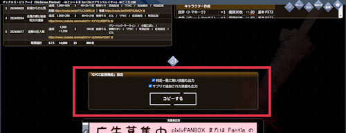
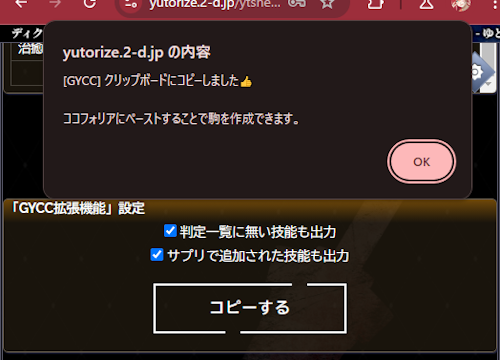
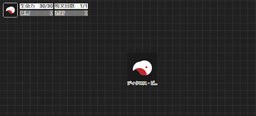
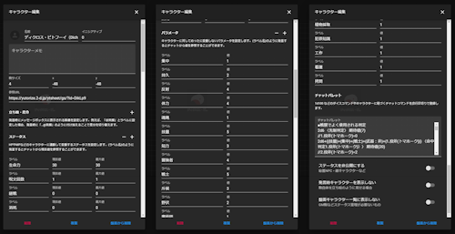

GYCC拡張機能
=====

ゆとシートのゴブリンスレイヤーTRPGからココフォリアの駒を生成するChromeの拡張です。

## 使い方
1. キャラクターシートを開き、戻るボタンの下に新たなメニューが追加されています。  

1. `コピーする` をクリックすると、ココフォリアの駒を生成するための情報がコピーされます。  

1. ココフォリアで<kbd>Ctrl</kbd>+<kbd>V</kbd>をすることで駒が生成されます。  

1. 以下の様にステータスやパラメータが設定されています。

## インストール
[GobslaYutoCC - Chrome ウェブストア](https://chrome.google.com/webstore/detail/GobslaYutoCC/ajofomcfmhjcbkgbkakhoebaefljeflb)

## 生成されるJSONについて
